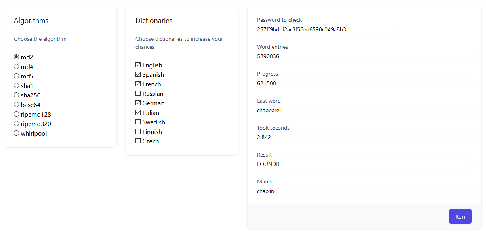

# WASM rust the ripper 
Password cracker made in WASM Rust, inspired by the popular John the Ripper.
The app uses a collection of password dictionaries and different algorithms to perform a brute attack in order to get the ciphered password.
<br/><br/>

## Available algorithms
Please, refer to each crate documentation and check its licensing.

| Name        | Algorithm  | Crates.io |
|-------------|------------|-----------|
| `md4`       | MD4      | [](https://crates.io/crates/md4)      |
| `md5`       | MD5     | [](https://crates.io/crates/md-5)     |
| `sha1`      | SHA-1   | [](https://crates.io/crates/sha-1)   |
| `sha256`    | SHA-2 256| [](https://crates.io/crates/sha256)|
| `base64`    | Base64   | [](https://crates.io/crates/base64)|

<br/><br/>



<br/><br/>

## Build and run in development environment

Download and install **wasm-pack** in case you don't have it.
```
cd /src/ripper_wasm
cargo install wasm-pack
```

Generate the WASM package
```
cargo build
wasm-pack build
```

Link locally the NPM package
```
cd pkg
npm link
cd /src/site
npm link ripper_wasm
```

Install NPM dependecies
```
npm install
```

Run
```
npm run serve
```

Enjoy

<br/><br/>

## License
This project is licensed under the terms of the MIT license. 
Check the [LICENSE](LICENSE.md) file out for license rights and limitations.