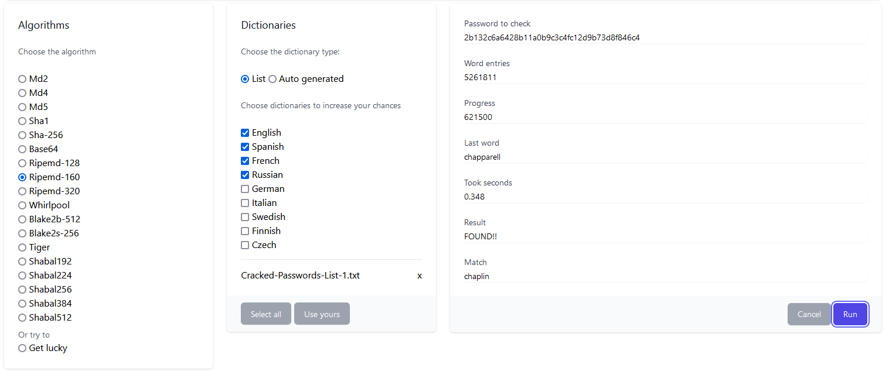
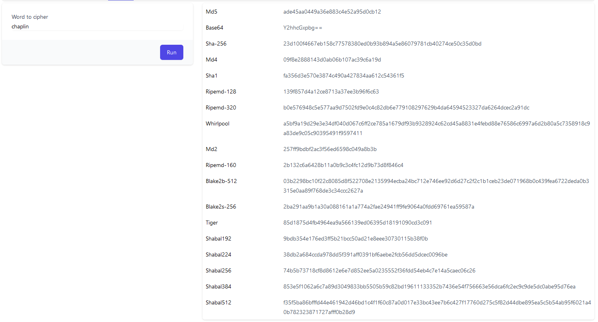

[](https://github.com/gcastellov/rust-ripper-wasm/actions/workflows/ci.yml)
[](https://github.com/gcastellov/rust-ripper-wasm/actions/workflows/docker-publish.yml)

[](/src/ripper_wasm/src/lib.rs)
[](/src/site/js/index.js)

# WASM rust the ripper 
Password cracker made in WASM Rust, inspired by the popular John the Ripper.
The app uses a collection of password dictionaries or auto generated words combined with different algorithms to perform a brute force attack in order to get the ciphered password.

## Available algorithms
Please, refer to each crate documentation and check its licensing.

| Name        | Algorithm   | Crates.io |
|-------------|-------------|-----------|
| `md2`       | MD2         | [](https://crates.io/crates/md2)      |
| `md4`       | MD4         | [](https://crates.io/crates/md4)      |
| `md5`       | MD5         | [](https://crates.io/crates/md5)     |
| `sha1`      | SHA-1       | [](https://crates.io/crates/sha-1)   |
| `rs_sha256` | SHA-2 256   | [](https://crates.io/crates/rs_sha256)|
| `base64`    | Base64      | [](https://crates.io/crates/base64)|
|`ripemd128`  | RIPEMD128   | [](https://crates.io/crates/ripemd128)|
|`ripemd160`  | RIPEMD160   | [](https://crates.io/crates/ripemd160)|
|`ripemd320`  | RIPEMD320   | [](https://crates.io/crates/ripemd320)|
|`whirlpool`  | WHIRLPOOL   | [](https://crates.io/crates/whirlpool)|
|`Blake2b`    | BLAKE2B-512 | [](https://crates.io/crates/blake2)|
|`Blake2s`    | BLAKE2S-256 | [](https://crates.io/crates/blake2)|
|`Tiger`      | TIGER       | [](https://crates.io/crates/tiger)|
|`Shabal192`  | SHABAL-192  | [](https://crates.io/crates/shabal)|
|`Shabal224`  | SHABAL-224  | [](https://crates.io/crates/shabal)|
|`Shabal256`  | SHABAL-256  | [](https://crates.io/crates/shabal)|
|`Shabal384`  | SHABAL-384  | [](https://crates.io/crates/shabal)|
|`Shabal512`  | SHABAL-512  | [](https://crates.io/crates/shabal)|

<br/>



<br/>



<br/>

## Build and run in development environment

Download and install **wasm-pack** in case you don't have it.
```
# cd /src/ripper_wasm
# cargo install wasm-pack
```

Generate the WASM package
```
# cargo build
# wasm-pack build
```

Link locally the NPM package
```
# cd pkg
# npm link
# cd /src/site
# npm link rust_ripper_wasm
```

Install NPM dependecies
```
# npm install
```

Run
```
# npm run serve
```
## Building and running docker
```
# docker build -f ./docker/Dockerfile  -t rust-ripper-wasm .
# docker run -p 8080:80 rust-ripper-wasm
```

## Stage environment
The application is being deployed at
[Stage](http://rust-ripper-wasm.azurewebsites.net)

## License
This project is licensed under the terms of the MIT license. 
Check the [LICENSE](LICENSE.md) file out for license rights and limitations.
